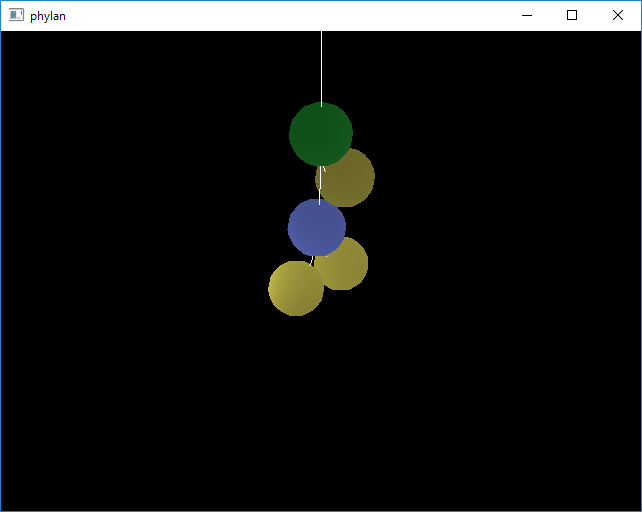

# phylanとは
物理演算ライブラリBulletPhysicsを使って作られたビジュアルプログラミング言語です.  
なるべくユーザーがキーボード操作だけでノードなどをストレスなく操作できるようにしていきたいです.  

# インストール方法

### Windowsな人
releaseディレクトリにて各バージョンのバイナリを配布しています.  
自分でビルドしたいっていう人は以下の手順に沿って頑張ってください.  
1. phylan.slnをVisual Studio 2015で開く  
2. メニューバーのプロジェクトからphylanのプロパティを選択  
3. 左のカラムのC/C++をクリック  
4. 追加のインクルードディレクトリのC:\local\で始まるものを編集して自分の環境のbulletやglfw3やpicojsonがあるディレクトリを指定する  
5. 右下の適用ボタンをクリック  
5. 次に左のカラムからリンカーをクリックする  
6. 使いのライブラリディレクトリを編集して自分の環境のbulletやglfw3のライブラリがある場所を指定する  
7. 右下の適用ボタンをクリック  
8. OKボタンをクリックしてダイアログを閉じる  
9. F5押したりしてビルドする  

### Linuxな人

一応GNU Makefileを書いているが一度も試していないので多分ビルドに失敗する  
ぶっちゃけbulletとglfw3を使っているだけで何も特別なことはしてないので頑張ってほしい  

### Mac OS X

Mac OS Xの環境が僕の手元にないので試しようがない  
頑張ってほしい  

# 使い方

実行すると真っ黒い画面が出てくる. 実行するときに引数でファイル名を指定すればそれを読み込んだ状態で開いてくれる.  

### 画面

実行画面はこんな感じ

それぞれの球は

* 緑色なら足し算のノード
* 青色なら掛け算のノード
* 紫色なら値を表示するノード
* 赤色なら条件分岐のノード
* 黄色なら数リテラルを表すノード
* 黒色なら未定義のノード

を表しています.  
現段階では数値リテラルや条件を表示できていませんが, 将来的に実装していくつもりです.  

### キーボード操作

cキーでコマンドモードになる.
コマンドモードではファイルの読み込み書き込みやフォーカスが当たってるノードの編集ができる.  

vキーで現在の構文木の値を評価して出力する. Undefined Nodeを評価しようとすると怒る.  

J, L, Iキーでフォーカスを変更する.  
J, Lキーでは現在フォーカスが当たってるノードの子ノードにフォーカスをあてる.  
Iキーでは現在フォーカスが当たってるノードの親ノードにフォーカスをあてる.  

## マウス操作

カメラを動かす

# 実装に関して

このソフトウェアはC++によって書かれています.  
このソフトウェアには以下の機能が実装されています.

* ウィンドウを表示して抽象構文木を描画
* 抽象構文木のノードを球, ノード間をゴム紐のような弾性体とした物理演算
* 抽象構文木のファイル読み込みと書き出し

ウィンドウや描画周りはGLFW3を使いました.  
物理演算に関しては授業中に指定のあったBulletPhysicsを利用しました.  
抽象構文木の読み込みと書き込みは抽象構文木をpicojsonによりJSON形式に変換して実現しました.  

授業は終わりましたが現在も鋭意製作中なのでどんどん機能を追加していく予定です.  
例えば

* freetypeを利用して数値リテラルノードの値などを画面上に表示する
* sequence式やlet式などを追加する
* LLVM IRなどの中間言語に出力できるようにする
* より分かりやすく操作しやすいUIにする

などしていきたいと思っています.  

